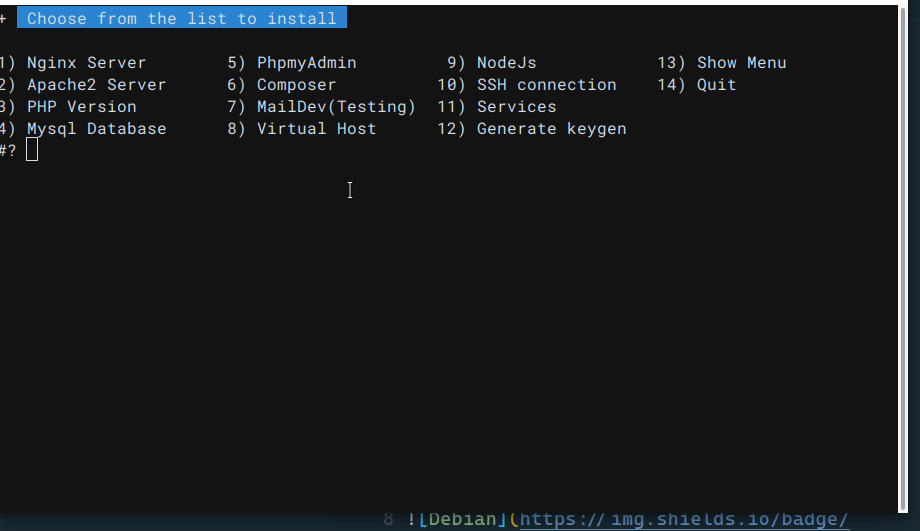

## dev-setup Shell
 
> 🚀 `dev-setup`  It is a script shell to help developers install the necessary needs on the server, whether servers nginx or apache2 or databases , lamp or lemp , connect remote server,  virtual hosting  to speed up workflow  


<a href="https://github.com/app-eg/laravel_Bash/releases/latest">
</a>

---

 

### 📦 Menu  
    .
    ├── Nginx Server          ✔ install Nginx web server 
    ├── Apache2 Server        ✔ install Apache2 web server 
    ├── PHP Version           ✔ install selected php version
    ├── Mysql Database        ✔ install Mysql server
    ├── PhpmyAdmin            ✔ install phpmyadmin requires [mysql,php]
    ├── Composer              ✔ install composer require [php]
    ├── MailDev(Testing)      ✔ Install And Run Smtp Mail for testing 
    ├── Virtual Host          ✔ create Virtual Host requires [nginx or apache]
    ├── NodeJs                ✔ install nodejs or nvm
    ├── SSH connection        ✔ SSH to Connect to a Remote Server
    ├── Services              ✔ list Services
    ├── Generate keygen       ✔ generate public and private key
    ├── Show Menu             ✔ Show Menu List
    └── Quit                  ✔ exit bash


#### ⚙ How it Work

``` bash

chmod +x devsetup.sh
chmod +x virtualhost-apache.sh
chmod +x virtualhost-nginx.sh
./devsetup.sh

```

#### ⚙ Contributing
- ⚙ Send us a PR, github issue, or email at app_eg@mail.com
